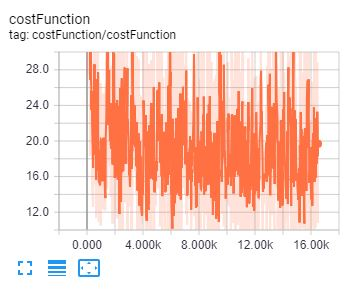
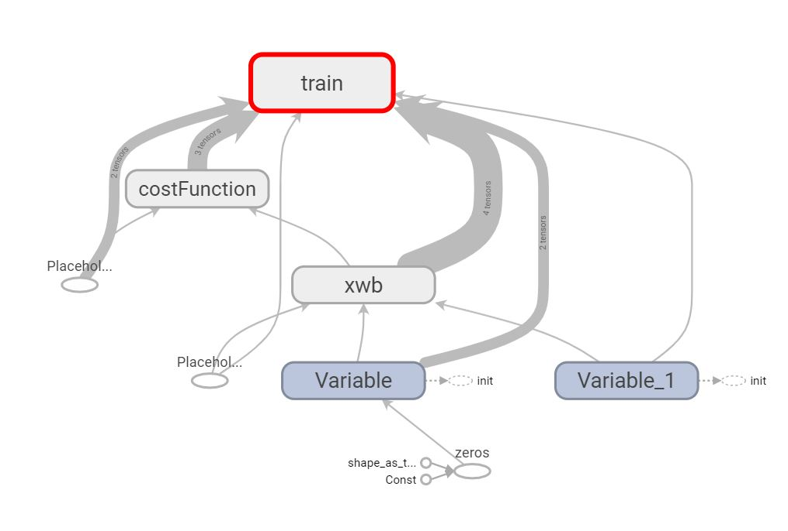

# basicMNIST

## Context :
Basic MNIST classifier with Tensorflow  

This is what you get when you follow the instructions of the ["Tensorflow in 5 min"](https://www.youtube.com/watch?v=2FmcHiLCwTU) youtube video by Siraj Raval.

His code use depreciated functions, here is a working version with tensorflow 1.11


## Results :
### Console

```
Extracting MNIST_data\train-images-idx3-ubyte.gz
Extracting MNIST_data\train-labels-idx1-ubyte.gz
Extracting MNIST_data\t10k-images-idx3-ubyte.gz
Extracting MNIST_data\t10k-labels-idx1-ubyte.gz
Iteration : 0 Cost : 29.817894125851726
Iteration : 2 Cost : 21.130649351640162
Iteration : 4 Cost : 20.10863752798601
Iteration : 6 Cost : 19.765252855474312
Iteration : 8 Cost : 19.283986275412822
Iteration : 10 Cost : 19.146469117077917
Iteration : 12 Cost : 18.92644349271599
Iteration : 14 Cost : 18.775952600132353
Iteration : 16 Cost : 18.649246670116085
Iteration : 18 Cost : 18.424786586761478
Iteration : 20 Cost : 18.3602806559476
Iteration : 22 Cost : 18.464498123689108
Iteration : 24 Cost : 18.31127820621837
Iteration : 26 Cost : 18.199800104661428
Iteration : 28 Cost : 18.081295450383966
Training completed
Accuracy : 0.9221
```

### Tensorboard
#### Cost Function

#### Graph


